# MangaCat

## Overview
MangaCat is an ad-free native Android manga reader. It's still in development, so not all features are implemented yet.  
The app uses a Rest API from MangaDex: https://api.mangadex.org/docs/. If you wish to use a web version of MangaDex developed by their team, visit https://mangadex.org/.

## Functionality
✅ - Implemented  
❌ - Not yet implemented

### Home page displays:
- Seasonal manga ✅
- MangaDex staff recommendations - "Staff Picks" ✅
- Popular New Titles ❌
- Recently added chapters - "Latest Updates" ❌
- New added manga - "Recently Added" ❌

### Column view
- Navigation button on home page elements navigates to a column view ✅
- Loads more manga while scrolling ❌

### Login page
- Allows user to log in ✅

### Profile page
- Displays user details ✅
- User settings ❌

### Manga page:
- Navigate back button ✅
- Navigate to details button ✅
- Displays the cover and most important manga information ✅
- Displays a list of chapters with chapter number, upload date, scanlation group, uploader user ✅
- Displays chapters already read by user ❌
- Tap on chapter to navigate to reading screen ✅

### Manga Details page:
- Displays a detailed manga information: title, description, themes, format, etc. ✅

###  Manga Related page:
- Displays related content: users, groups, manga (spin offs, etc.) ✅
- Tap on user, group, manga to navigate to the relevant screen ❌

### Manga Covers page:
- Displays a list of manga covers ✅
- Select a cover to view it in full sreen ❌

### Manga Read page:
- Displays a selected chapter pages in correct order ✅
- Navigation back button ✅
- Tap a screen to show/hide buttons ✅
- User can change reading settings (e.g. swap pages instead of scrolling) ❌
- Finishing a chapter saves it as already read ❌

### User library page
- Groups by category (reading, plan to read, etc.) ✅
- Displays a manga's information (cover, title, etc.) ❌ - it only displays titles

### Search page ❌
- Allows users to search by title ❌
- Advanced search (genre, theme, etc.) ❌

### Additional
- Day/Night mode ✅
- Language settings ❌

## Screenshots

### Home page
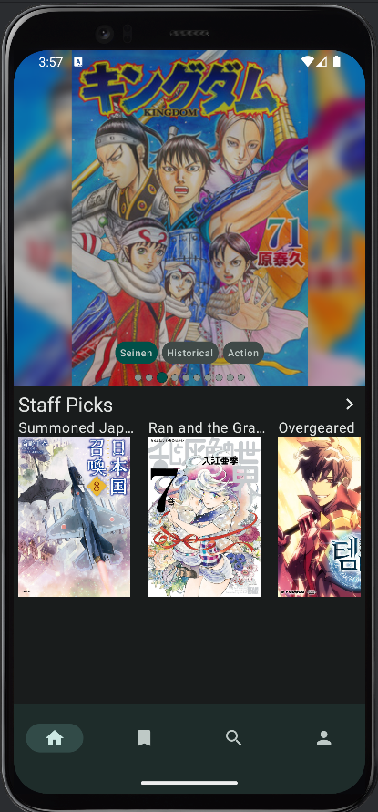

### Column view
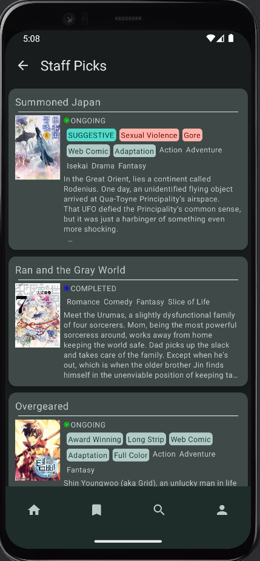

### Login page
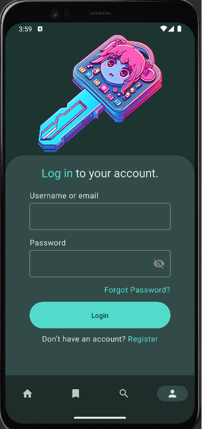

### Profile page
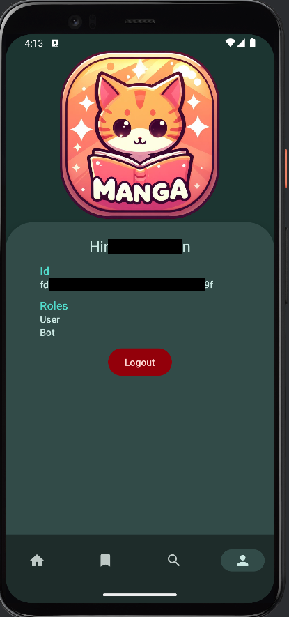

### Manga page
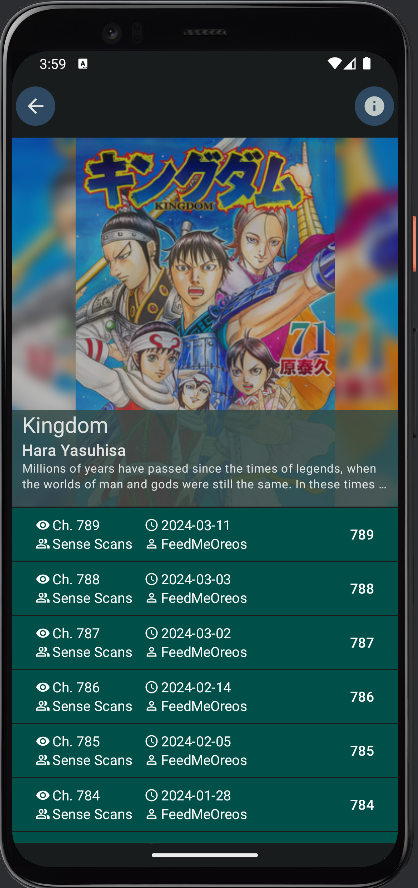

### Manga Details page
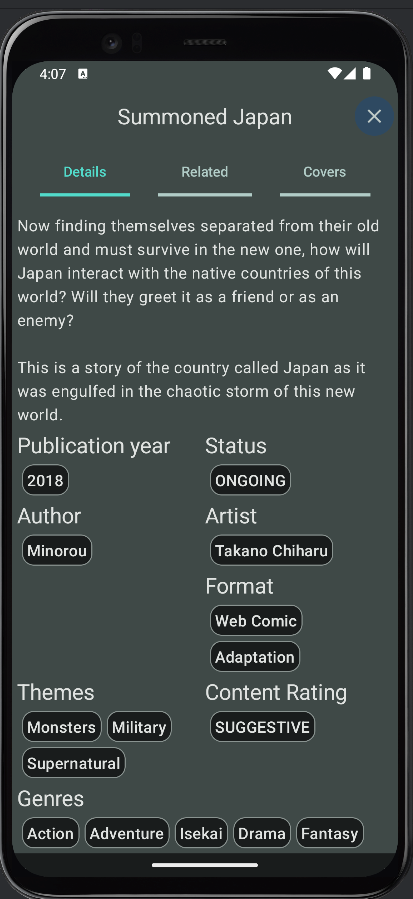

### Manga Related page
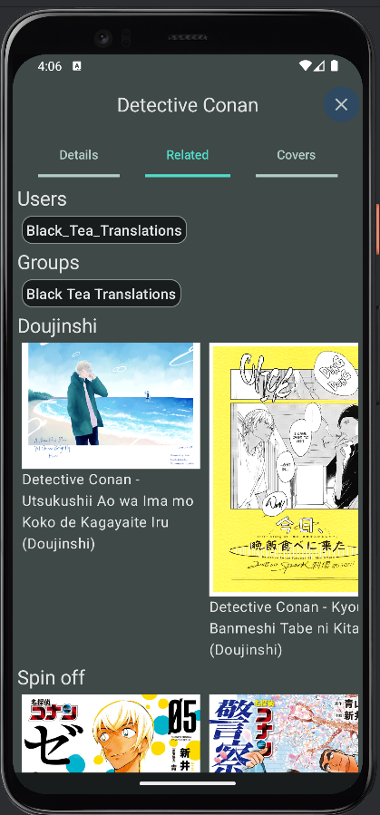

### Manga Covers page
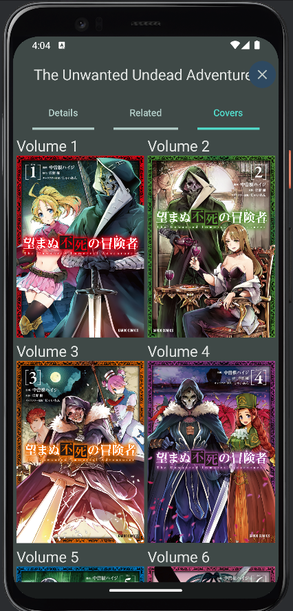

### Manga Read page
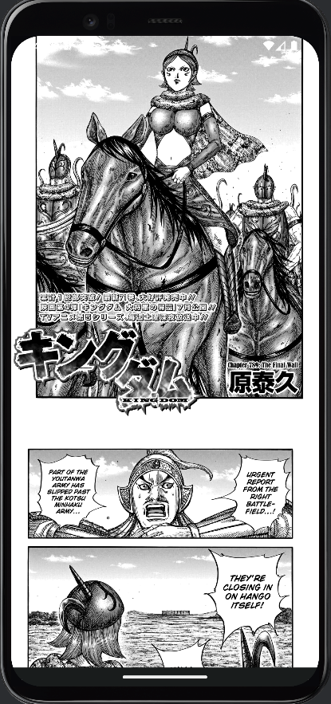

### Manga Read page with buttons
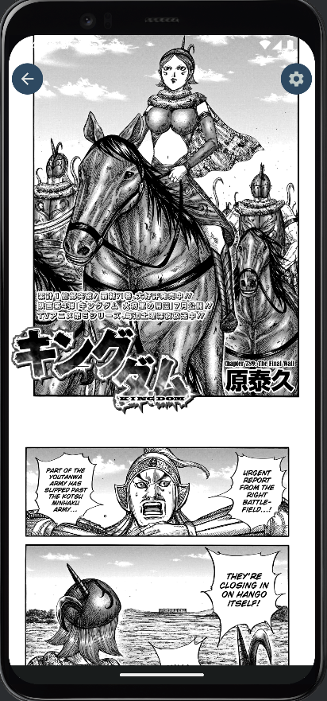

### User Library page
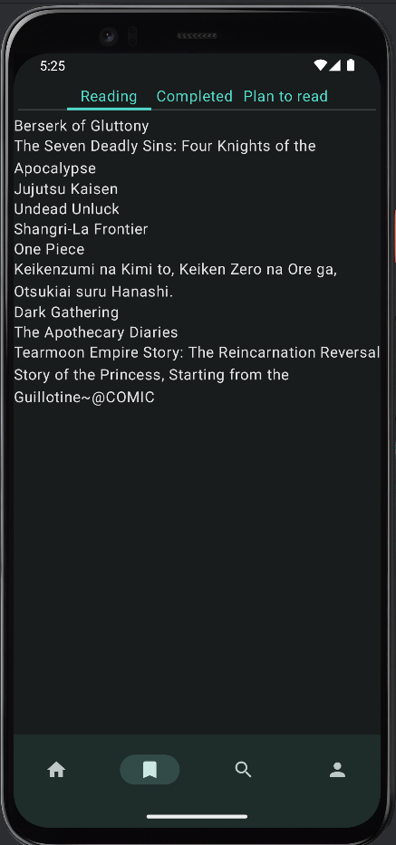

